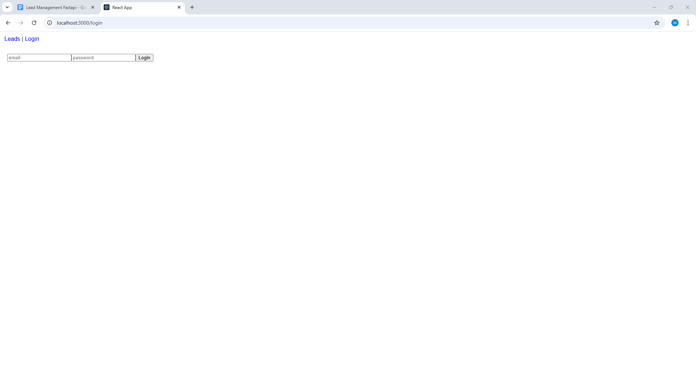

# **Lead Management System (React + FastAPI + PostgreSQL)**
<p align="center">
  
  Watch My Demo:
  https://youtu.be/VEWHFmKNO2c?si=j_6FUYbjBTVRr4xe
</p>

A full-stack **Lead Management System** designed for sales teams to track, organize, and manage customer leads efficiently.
Built with a **React frontend**, **FastAPI backend**, and **PostgreSQL** database, this application supports complete CRUD operations, authentication, and role-based access.

---

##  **Features**

### ** User Authentication**

* JWT-based login & signup
* Password hashing using Passlib
* Secure protected routes

### ** Lead Management**

* Create new leads
* Update lead information
* Assign leads to users
* Track lead source, status, and priority
* Delete / archive leads

### ** REST API (FastAPI)**

* Modular router-based architecture
* Pydantic models (FastAPI v2 compatible)
* Input validation & schema generation
* Auto-generated docs via Swagger & ReDoc

### ** Frontend (React)**

* User-friendly dashboard
* Add/Edit Lead forms
* Table view with sorting + filtering
* Axios API integration
* Toast notifications

### ** Database (PostgreSQL + SQLAlchemy)**

* Relational schema with foreign keys
* Leads, Users, Auth tokens
* Optimized queries

---

##  **Tech Stack**

### **Frontend**

* React
* TypeScript
* Axios
* React Router
* TailwindCSS / Material UI (optional)

### **Backend**

* Python FastAPI
* SQLAlchemy ORM
* PostgreSQL
* Uvicorn
* Passlib
* python-jose (JWT)

### **DevOps**

* Docker & Docker Compose
* Environment variables for secrets
* Hot reload for both frontend and backend

---

##  **Project Structure**

```
LeadManagement/
│
├── backend/
│   ├── app/
│   │   ├── main.py
│   │   ├── models/
│   │   ├── routers/
│   │   ├── schemas/
│   │   └── database.py
│   ├── requirements.txt
│   └── Dockerfile
│
└── frontend/
    ├── src/
    ├── package.json
    └── Dockerfile
```

---

# **API Endpoints**

### **Auth**

| Method | Endpoint       | Description       |
| ------ | -------------- | ----------------- |
| POST   | `/auth/login`  | Login user        |
| POST   | `/auth/signup` | Register new user |

### **Leads**

| Method | Endpoint      | Description   |
| ------ | ------------- | ------------- |
| GET    | `/leads/`     | Get all leads |
| POST   | `/leads/`     | Create a lead |
| PUT    | `/leads/{id}` | Update a lead |
| DELETE | `/leads/{id}` | Delete a lead |

---

#  **How to Run Locally**

##  Backend

```
cd backend
pip install -r requirements.txt
uvicorn app.main:app --reload
```

Runs at:
 [http://127.0.0.1:8000](http://127.0.0.1:8000)
 API Docs: [http://127.0.0.1:8000/docs](http://127.0.0.1:8000/docs)

---

##  Frontend

```
cd frontend
npm install
npm start
```

Runs at:
 [http://localhost:3000](http://localhost:3000)

---

#  **Docker Setup (Optional)**

```
docker-compose up --build
```

This starts:

* React app
* FastAPI
* PostgreSQL DB

---

#  **Why I Built This Project**

This project is designed as a **production-ready full stack system** 
* Real authentication
* Secure API development
* SQL database modeling
* React frontend architecture
* Full CRUD implementation
* API integration & state handling
* Clean code & scalability

It is ideal for:

* SaaS CRM tools
* Small business lead tracking
* Sales team workflow automation

---

#  **Author**

**Manibala Sinha**
Full Stack Developer — React, Node.js, Python
 Vaughan, ON
 GitHub: [https://github.com/ManibalaSinha](https://github.com/ManibalaSinha/Management)


